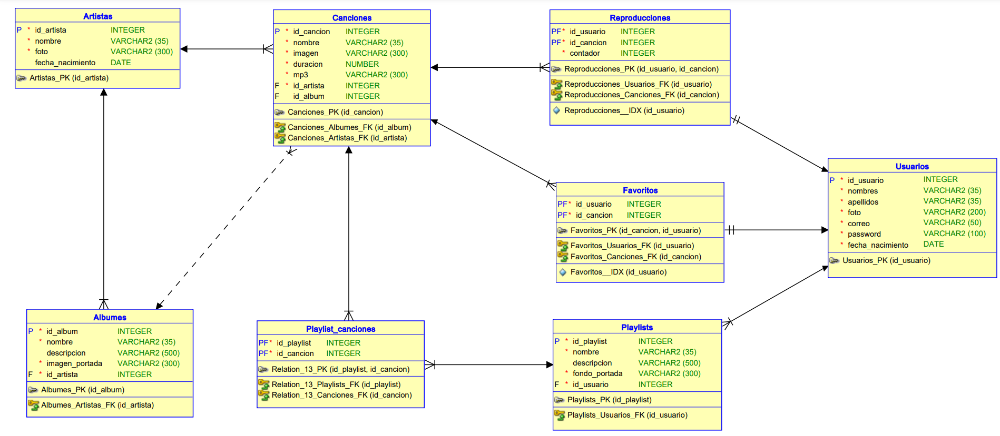

# Manual técnico 

# Objetivos del Proyecto

## Objetivo General
Implementar una arquitectura de aplicación web de transmisión de música que utilice servicios de AWS, incluyendo S3, EC2, un balanceador de carga, una base de datos (RDS o DynamoDB) y IAM para garantizar la escalabilidad, disponibilidad y seguridad de la aplicación.

## Objetivos Específicos

1. **Despliegue en S3:** Configurar un bucket de S3 con el nombre "sound-stream-semi1-g#" para alojar la aplicación web estática.

2. **Almacenamiento Multimedia:** Configurar otro bucket de S3 llamado "multimedia-semi1-g#" con dos carpetas ("Fotos" y "Canciones") para almacenar imágenes de perfil, arte de artistas, álbumes, playlists y archivos MP3.

3. **Implementación de Servidores EC2:** Configurar dos instancias EC2 con servidores idénticos en Node.js y Python que alojen la lógica de la aplicación web.

4. **Seguridad en EC2:** Asegurar que los Security Groups de las instancias EC2 estén configurados adecuadamente, habilitando solo los puertos necesarios para la aplicación y garantizando su seguridad.

5. **Configuración de Load Balancer:** Implementar un balanceador de carga para distribuir el tráfico entre las dos instancias EC2 y asegurar la alta disponibilidad de la aplicación.

6. **Base de Datos RDS o DynamoDB:** Configurar y utilizar una instancia de RDS o DynamoDB para almacenar datos de la aplicación, asegurando que las contraseñas estén encriptadas y que las URLs de archivos e imágenes se guarden adecuadamente.

# Explicación de la Arquitectura del Proyecto

La arquitectura del proyecto consta de varios componentes clave que trabajan juntos para proporcionar una aplicación de transmisión de música escalable y segura:

1. **S3 Buckets:**
   - El bucket "sound-stream-semi1-g9" aloja la aplicación web estática, incluyendo archivos HTML, CSS y JavaScript.
   - El bucket "multimedia-semi1-g9" contiene carpetas para almacenar imágenes (Fotos) y archivos MP3 (Canciones).

2. **EC2 Instances:**
   - Se utilizan dos instancias EC2 para alojar servidores con la lógica de la aplicación en Node.js y Python.
   - Estas instancias son idénticas y se utilizan para garantizar la alta disponibilidad y escalabilidad de la aplicación.

3. **Load Balancer:**
   - El balanceador de carga distribuye el tráfico entrante entre las dos instancias EC2.
   - Asegura que la aplicación esté siempre disponible y equilibra la carga para evitar la sobrecarga de un servidor específico.

4. **RDS:**
   - Se utiliza una instancia de RDS (Relational Database Service) como base de datos para almacenar datos de la aplicación, como información de usuarios, listas de reproducción y metadatos de canciones.
   - Las contraseñas de los usuarios se almacenan encriptadas para garantizar la seguridad de los datos.

5. **IAM Users:**
   - Se crean usuarios de IAM (Identity and Access Management) para gestionar y utilizar los servicios de AWS necesarios para la aplicación.
   - Cada usuario tiene políticas asociadas para controlar sus permisos y accesos.

# Diagrama Entidad Relación

A continuación se presenta el diagrama entidad relación de la base de datos de la aplicación:

